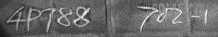

# 中鋼人工智慧挑戰賽 - 字元辨識

這是「[中鋼人工智慧挑戰賽 - 字元辨識](https://tbrain.trendmicro.com.tw/Competitions/Details/17)」第一名的實作程式碼，依競賽規則公開。

## 競賽目標

此競賽的目標是要以人工智慧演算法，實現鋼胚上印刷或手寫序號的自動判別，這將有助於問題源的返溯及品質的控管。參賽者除了要能辨識正常印刷之序號 (含數字及英文字母)，還得針對手寫序號、序號上下顛倒、重複印刷序號、或序號模糊等情況做有效的處理，以發展出適合實際產線運作的序號辨識系統。

以下是兩張原始待識別的圖片範例：

 

## 作法摘要

主辦單位所提供的訓練資料裡約有 2/3 的資料是有提供序號出現的位置座標，因此識別序號第一步可以使用物件偵測 (Object Detection) 技術先將圖片裡的序號位置預測出來 (本專案使用 [YOLO5](https://github.com/ultralytics/yolov5))。

然後裁切取出後再交由「序號識別模型」來識別，而模型主架構為 CNN + Transformer。我們總共用了 4 種 CNN 模型當 backbone，每種模型各訓練 5 個 fold，所以總共會有 20 個訓練出來的模型權重，最後 ensemble 這些模型，得出最後答案。

## 序號偵測模型

訓練 YOLO5 時需要把訓練資料安排成它規範的目錄結構及標籤結構，可使用 utils/prepare_csc_for_yolo.py 程式組織訓練資料。該程式除了組織資料外，也將原始圖片都轉成灰階並以直方圖均衡化處理。

**訓練模型指令：**

```python train.py --img 640 --batch 16 --epochs 100 --data csc.yaml --weights yolov5x6.pt --device 0```

YOLO5 會將訓練結果放在 yolov5/runs/train/expN/weights/best.pt

**序號偵測並裁切指令：**

```python detect.py --weights runs/train/exp/weights/best.pt --source ../../csc-datasets/public_training_data --device 0 --save-crop```

YOLO5 會將偵測到的序號圖片裁切後放在 yolov5/runs/detect/expN/crops/sn/

由於 YOLO5 在推論時，有時會將距離較遠的序號分割成多個部份，因此我們有修改 detect.py 程式，使得在垂直方向重疊的方框合併。

最後裁切後的圖片看起來如下所示：




## 序號識別模型

序號識別模型主架構分成兩部份，第一部份由 CNN 負責，主要用來截取序號圖片裡的特徵，這邊我們直接站在巨人肩膀上，使用 ImageNet 許多著名的 CNN 模型，總共使用 Inception_v3、EfficientNet-b4、VGG16、DenseNet201 四種模型。但這些模型預設輸入都是正方形大小，而序號圖片卻是比例很懸殊的長方形，若是直接將其縮放成正方形大小，準確率不高，因此我們對這四種模型做了一些小修改，使序號圖片在通過模型後，feature map 的寬度可以維持在 58 左右。再將這些 feature map 送入次級 seq2seq 模型運算。

註：58 的 feature map 寬度是實驗後的較佳結果，若設定在 116 或 29，結果都沒有 58 來的好。

第二部份使用 seq2seq 模型來預測序號，這裡使用 Transformer 模型來擔任這個角色，也有試過 Bi-LSTM，效果比 Transformer 差一點。

## 預訓練模型

由於主辦單位提供的訓練資料只有 18104 張，而且某些字元出現的頻率很低，例如 B, C, D, E, J 等等的字元，與高頻率字元 0, 1, 2, 3, 4 等等差了將近 100 倍；另外訓練資料裡的「手寫字跡」數量與另一種疑似「噴漆字跡」的數量相比，也差了非常多倍。為了讓模型能充份學習到每個字元的特徵，包含「手寫字跡」與「噴漆字跡」，特別合成了 1000K 張「合成序號」來讓 CNN backbone 事先從這些資料裡學習影像特徵。而這些合成序號主要用到了三種材料：

1. 從 public training data 裡分割出來的字元影像 (使用 utils/cut_char_images.py 來取出字元影像)
2. 從 emnist dataset 裡取出部份手寫字元影像 ([emnist 連結](https://www.westernsydney.edu.au/icns/reproducible_research/publication_support_materials/emnist))
3. 從 public training data 裡取出若干背景圖片 (用影像處理軟體將字元抹除)

合成程式請參考 utils/generate_synthetic_crop.py，合成出來的效果如下所示：


這裡需要注意的是這些合成序號的字元都是隨機產生的，不能直接拿來當成「序號識別模型」的訓練資料使用，因為中鋼的序號有特定的編碼規則，若直接拿來用會破壞這些編碼規則的分佈，讓 seq2seq 模型學習到錯誤的資訊。

因此，將預訓練模型的目標設定為識別圖片中是否有出現 ground truth 裡的字元，變成是一個 multi-label 的任務。訓練完成之後拿掉分類層，留下 CNN backbone 權重給「序號識別模型」訓練使用。

**效果差異：**

使用預訓練比起沒有預訓練在最終效能上，「字元準確度」有顯著提升，但「序號準確度」也就是競賽評比的指標卻沒有顯著提升，這代表預測錯誤的這些圖片通常有一個關鍵的字元不管是否預訓練皆辨識錯誤。即便如此，我們還是以「字元準確度」做為最終模型評選的標準。

## 集成預測

在我們使用了四種 CNN backbone 之後，雖然 Inception_v3 效果最佳，但預測準確度 (on public testing data) 仍然比不上四個模型的集成預測，因此我們總共使用了 20 個模型 (4 種 CNN x 5 個 fold) 來集成。這裡採用投票制，最多模型預測的答案為最終答案，若票數相同，以效能較高的模型勝出。
